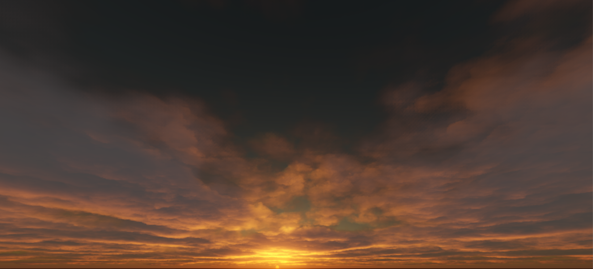
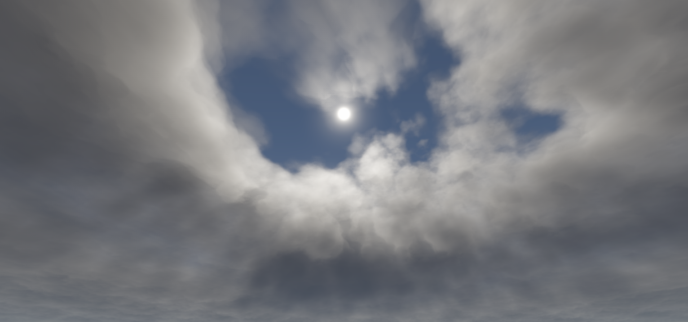
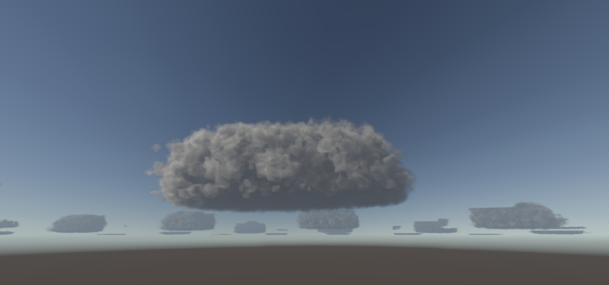
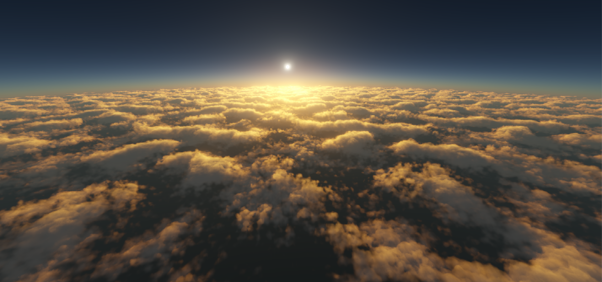
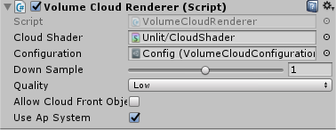
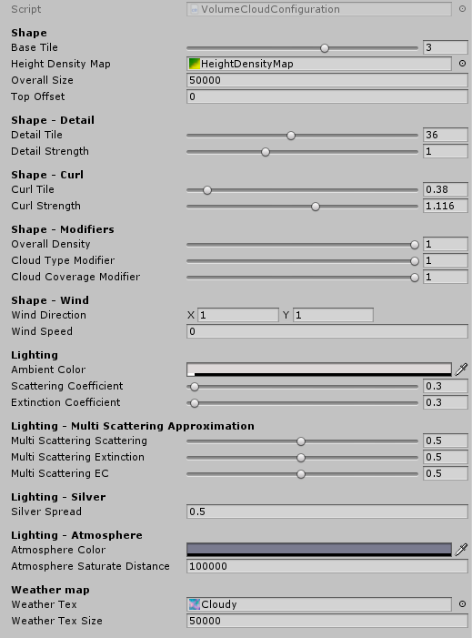

# Volume Cloud for Unity3D

*Cloud at dawn.*  

*Cloud forms a hole in the sky.*  

*A huge cloud at distant.*  

*Cloud view from above. With the hi-height(name from hi-z since they're similar) technique, a much larger view range could be used when rendering cloud.  The screenshot is rendered with my atmosphere scattering system([Here](https://github.com/yangrc1234/AtmosphereScatter))*  
*(The ap system is just my hobby project, not optimized at all. It's included in this repo, use it at your own risk).*

**Volume Cloud for Unity3D** is a plugin for rendering cloud using raymarch. For now only compatible with standard rendering pipeline.

# Quick startup
Clone the repo, find three screenshot scenes under folder in Assets/VolumeCloud/Example, and you should see the cloud right away.  

# Setup  
In this section you'll learn how to setup and adjust the shape and looking of the cloud.
## Camera Script 
1. Attach VolumeCloudRenderer to your camera. It's advised to put it before any post processing scripts. Once you add the script, the values in Inspector be filled with default values, and you should see effect right away.  
  
2. Adjust rendering settings. 
* **DownSample** option let cloud rendered into a low-resolution buffer, which greatly saves gpu performance. Setting to 1 means half the resolution, and 2 for quater.
* **Quality** option controls the sample count during raymarching. Lower quality only does half samples than high quality. Some noise pattern are visible when using low quality.
* **Allow cloud front object**. Turn on this option so that cloud could be rendered in front of object, but this brings a little artifact when object moves around. If you're sure your camera won't go into cloud, uncheck it.
* **Use Ap system**. Check this only when AtmosphereScatteringLutManager script in scene. (It will have impact on performance, since the atmosphere scattering system is not very optimized. I only used it for the screenshot.)  
The script has a config parameter. Create a new config by rightclick - Create - Volume Cloud Configuration. By default there's a config file under Assets\VolumeCloud\Example.  
There're many paramters you can tweak in the config file. Most of the params are intuitive enough to play with.
* **Use Hi-Height Map**. Check to enable Hi-height map feature. The Hi-height map is an empty space skipping technique. It could help extending the view range above cloud layer, skipping lots of samples when there's no cloud with some extra 2D texture lookups. It introduces some overheads, but saves the sample count required to render distant cloud.   
3. Adjust cloud properties in the config file. See below.

# Cloud Configuration
Most cloud properties are seprated from the script into the config asset for reuse.  
  
The default config in example should be nice enough to use. If you want do more control, continue reading. The most important options are listed below. Other options are not important or intuitive enough.  

## Weather map  
The weather Tex tells the renderer how does cloud formed over sky. It's most important if you want to adjust your sky.  
RGB channles are used, R channel for cloud coverage. G channel for wetness, and B for cloud type(see below).  
For now there isn't an automatic way to generate a weather map, just paint it yourself, or use those in example.  

## Height-Density Map(Idea from [4])
Height-density map describes the density of your cloud at specified height and type. X-axis for cloud type used in weather tex, Y-axis for height.  
On the R channel, density is set for corresponding cloud type and height.  
On the G channel, a detail value is set for corresponding cloud type and height. Higher the value, more "round" will the cloud be.  

## Shape / Shape-Detail / Shape-Curl
The basic idea of volume cloud rendering is raymarch though 3D cloud-like noise texture. Here two textures are used, naming base texture and detail texture.  
The cloud shape is formed from base texture, then subtracted by detail texture.  
Also, a curl noise is used to offset detail texture sampling, to provide a turbulence-like effect.  
Adjust corresponding settings will affect how sampling is done.  

## Shape Modifiers
These are global modifiers for some values. Just leave them for 1.

## Lighting  
The cloud lighting contains ambient light and directional light color contribution.  
Ambient color is directly added to final result no matter what.   
Scattering/Extinction coefficient are used to adjust how directional light affects cloud. Extinction describes how much cloud receives light, and scattering describes how much cloud scatters the light. Extinction value should never be greater than scattering value unless you want a non-physical effect(Or, the cloud in your game can glow).  
The multi-scattering section contains parameters for simulate multi-scattering effects. The idea is from [4]. Hover your mouse over the label for more info.  

## Lighting - Silver
This value controls how does the silver effect spread over cloud. Lower value causes silver effect more concentrated around sun and brighter.  

## Lighting - Atmosphere
Atmosphere saturate distance indicates how far will the cloud be invisible due to atmosphere. The cloud alpha value will begin to drop in distance, and finally become transparent in the distance set.  

## Wind  
Wind effect simulates the cloud moving by rotating the noise texture. So the overall cloud position won't be changed.  

# Misc
If you're intersted in how volume cloud is implemented, see the references. Or if you're intersted at what improvements I made and how, refer to the IMPLEMENTATIONDETAIL.md at root folder.

## Benchmark
The benchmark here is done in Unity Editor (Sorry for my lazyness), on my laptop with GTX 1060 6G.

Two tables are listed, with the first set to same options used to render screenshots at top, to show the performance under generic usage.  

And the second rendered at full resolution, to better show how each option affects performance.  

| Scene  | Quality | DownSample | Hi-Height enabled  | Fps | Comment |
| ------------- | ------------- | ------------- | ------------- |------------- |------------- |
| Screenshot1  | Low  | Half | True   | 1.0ms  | |
| Screenshot2  | Low  | Half | True  | 1.0ms  | |
| Screenshot3  | Low  | Half | True   | 1.1ms  | | 
| Screenshot4  | Low  | Half | True  | 5.0ms  | Above cloud layer, many hi-height lookups |

| Scene  | Quality | DownSample | Hi-Height enabled  | Fps | Comment |
| ------------- | ------------- | ------------- | ------------- |------------- |------------- |
| Screenshot1  | Low  | Full | True   | 9.0ms  | |
| Screenshot1  | Low  | Full | False  | 7.2ms  | |
| Screenshot1  | High  | Full | True   | 10.0ms  | |
| Screenshot4  | Low  | Full | True  | 11.5ms  | Above cloud layer, many hi-height lookups|

## Known issues
Object edge glitch when allow cloud front is checked and downsampled, due to edge-preserving upsample is not implemented yet.

## TODO
- [x] Add aerial perspective things.  
- [x] Extend view distance above cloud.
- [ ] HDRP integration?  
- [ ] Weather map generator.  
- [ ] Make the noise generator usable.  

## References
[1][The Real-time Volumetric Cloudscapes of Horizon: Zero Dawn](http://www.advances.realtimerendering.com/s2015/index.html)  
[2][Nubis: Authoring Real-Time Volumetric Cloudscapes with the Decima Engine](http://www.advances.realtimerendering.com/s2017/index.html)  
[3][TAA from playdead](https://github.com/playdeadgames/temporal)  
[4][Physically Based Sky, Atmosphere and Cloud Rendering in Frostbite](https://media.contentapi.ea.com/content/dam/eacom/frostbite/files/s2016-pbs-frostbite-sky-clouds-new.pdf)  
[5][Cool TAA history clip from zhihu](https://zhuanlan.zhihu.com/p/64993622)

## History.
18/4/15 - Fixed "band" glitch.  
18/7/7 - Added low-resolution rendering.    
18/10/28 - Added Height-Density map from [4]  
19/3/2 - Added depth estimation stuff, reduced blur problem when rotating camera.  
19/3/4 - Rewrite lighting code, using methods from [4], it should be very "physically based" now.  
19/5/18 - Rewrite raymarch and TAA. The 4x4 pattern is obsoleted. A full-screen raymarch with much lower sample count and temporal reprojection is used now.  
19/5/31 - Hi-Height technique implemented.  