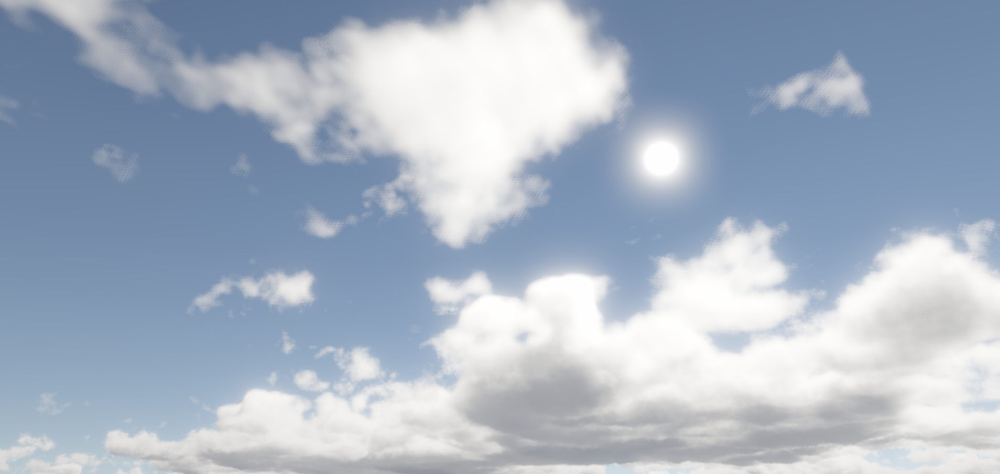
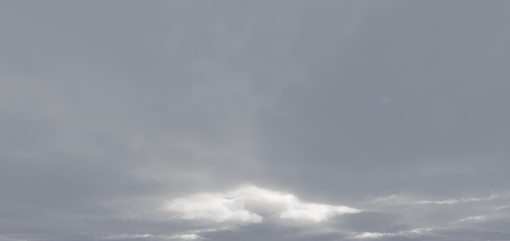
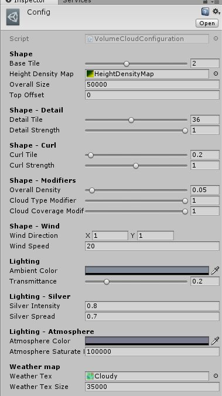

# Volume Cloud for Unity3D
This is an volume cloud rendering implementation for Unity3D using methods from[1].

## Setup
To setup the effect, you need to attach the script CloudVolumeRenderer to your camera.  
Any other post-processing effects should be placed after it.  
The down sample option makes the cloud rendering downsampled. It's advised to set to 1, which means render at half the resolution, not much difference, but huge performance gain.  
The script has a config parameter. Create a new config by rightclick - Create - Volume Cloud Configuration. By default there's a config file under Assets\VolumeCloud\Example.  
  
There're many paramters you can tweak in the config file. Most of the params are intuitive enough to play with.
  

### Weather map
The weather map tells the renderer infos about cloud. the first 3 channles are used. R channel means cloud coverage. G channel means cloud density, and B channel means cloud type(basically, the higher it is, the taller cloud is). The coverage is different from density, since low density won't clip the cloud, but only makes it brighter.  
For now there isn't an automatic way to generate a weather map, just paint it yourself, or use the one in example.  

### Height-Density Map
You can assign a height-density map to a config. The texture shows the shape of different cloud type[4]. Channel R is density, and channel B is the "detailness"(see shape part). The x-axis of texture represents the cloud-type value, and y-axis is the height.  

### Wind
For now you can set a wind effect. The effect doesn't actually moves the weather map, but only moves the base texture offset, using the time value and wind speed value. So changing wind values during playing could cause problems for now.

## Implementation details.
Most of the techniques are the same from the slides.  
1. The rendering is a post-processing effect.  
2. First a quarter-res buffer is rendered, including building the cloud shape and sample for light. (The result contains intensity, density and depth).  
3. A history buffer is maintained, by blending history buffer(reprojected so to sample correctly) and the quarter-res buffer together to make new one.(quarter-res buffer is firstly shaded then blended with history buffer.)  
4. Blit the cloud image with final image.  

### How is shape evaluated  
First of all, there're two types of noise texture(inside Resources folder), we call them base texture, which is larger, and detail texture, which is smaller and "shovels" the result of base texture, making the cloud looks more detailed.  
During rendering, the base texture is sampled, and multiplied by the height-density map sampling result, then got clipped using coverage value.  
Then the detail texture is used to erode the result from the last step.  
After all these, the density value from weather map G channel is used to adjust final result.

## Known issues 
Cloud can only be rendered behind objects. This is not resolved in the original presentation either.  
When moving the camera, the reprojection quality is not good, and whole image become blurred, the rendering process become very visible(especially when downsampled).  

## TODO
- [ ] Make the noise generator usable.
- [ ] Add aerial perspective things.
- [ ] Weather map generator.

## References
[1][The Real-time Volumetric Cloudscapes of Horizon: Zero Dawn](http://www.advances.realtimerendering.com/s2015/index.html)  
[2][Nubis: Authoring Real-Time Volumetric Cloudscapes with the Decima Engine](http://www.advances.realtimerendering.com/s2017/index.html)  
[3][TAA from playdead for reprojection code](https://github.com/playdeadgames/temporal)  
[4][Physically Based Sky, Atmosphere and Cloud Rendering in Frostbite](https://media.contentapi.ea.com/content/dam/eacom/frostbite/files/s2016-pbs-frostbite-sky-clouds-new.pdf)

## History.
18/4/15 - Fixed "band" glitch.  
18/7/7 - Added low-resolution rendering.
18/10/28 - Added Height-Density map from [4]